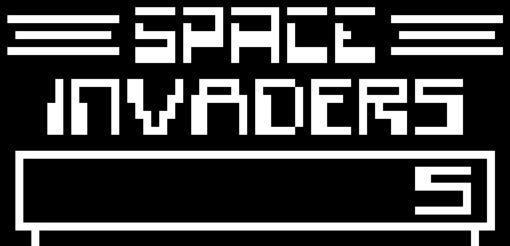
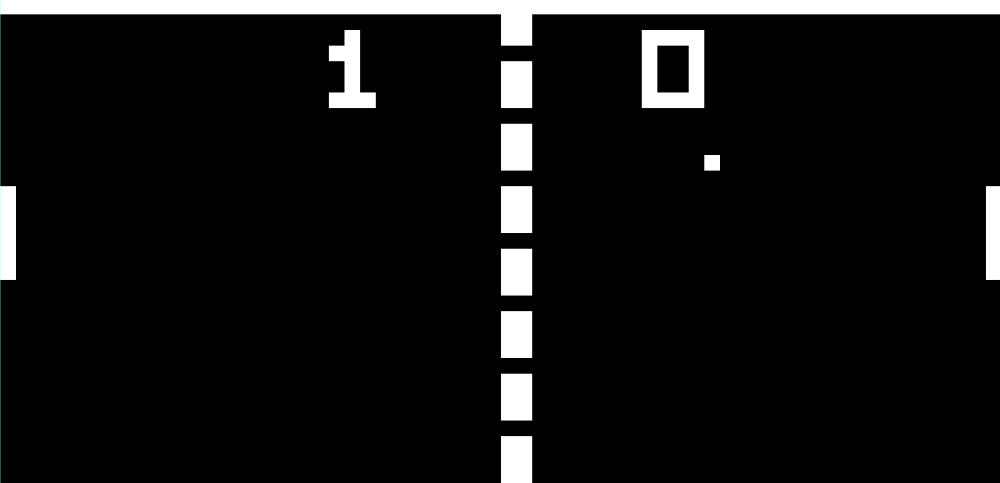

# Chip8 Emulator in C++. Just for the fun of it!

## What is Chip8 you might ask
Chip-8 is a simple, interpreted, programming language which was first used on some do-it-yourself computer systems in the late 1970s and early 1980s. The COSMAC VIP, DREAM 6800, and ETI 660 computers are a few examples. These computers typically were designed to use a television as a display, had between 1 and 4K of RAM, and used a 16-key hexadecimal keypad for input. The interpreter took up only 512 bytes of memory, and programs, which were entered into the computer in hexadecimal, were even smaller.

[Technical reference used for the emulator](https://en.wikipedia.org/wiki/CHIP-8#Virtual_machine_description)
## Compile
The only prerequisite is to have [SLD2](https://www.libsdl.org/download-2.0.php) installed on your system. If you're lazy like me I would suggest using [vcpkg](https://github.com/Microsoft/vcpkg).

## Run
To play a game simply pass a game file to the executable `chip8 cool_game.c8`

## Screenshots

### Missing Features
* Sounds
* Disassembler and debugger for c8 binaries

